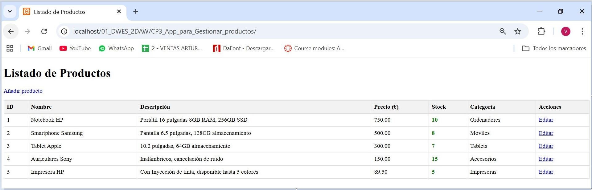

# 🛒 App Gestor de Stock (PHP)

Aplicación web desarrollada en **PHP** que implementa un sistema básico de **gestión de productos (stock)** mediante sesiones, validación del lado del servidor y una arquitectura organizada en **vistas + controladores**.  
Incluye un flujo completo de alta y edición simulada de productos, manejo de errores, mensajes de confirmación y buenas prácticas de seguridad (escape de salida para prevenir XSS).

---

## 🖼️ Vista previa

> Listado principal con la BD inicial



## 🖼️ Vista final

> Listado principal + confirmación tras alta de nuevo producto


---

## ✨ Funcionalidades

- 📋 **Listado de productos** almacenados en `$_SESSION`
- ➕ **Alta de producto** mediante formulario (POST)
- 🧾 **Validación server-side** centralizada y reutilizable
- ⚠️ **Gestión de errores** por sesión con repoblado de campos
- ✏️ **Edición simulada** mediante parámetro `GET` (`edit.php?id=...`)
- 🟢 Estado visual de disponibilidad: **Disponible / Agotado**
- 🔐 Protección **anti-XSS** con función `escape()`
- 🧠 Uso de:
  - funciones flecha (**arrow functions**)
  - `array_map()`
  - operador ternario
  - **closures** para validadores

---

## 🧰 Tecnologías utilizadas

- **PHP**
- **HTML**
- **Sesiones PHP** (`$_SESSION`)
- Validación server-side
- Estructuras de datos personalizadas (simulación de BBDD)

---

## 🗂️ Estructura del proyecto

```bash
.
├── index.php
├── add.php
├── add_process.php
├── edit.php
├── dataBase.php
├── funciones.php
└── img/
    └── (capturas del proyecto)
